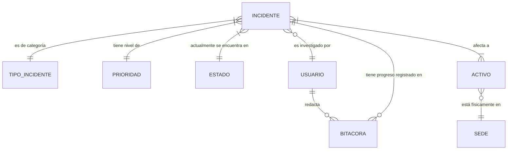
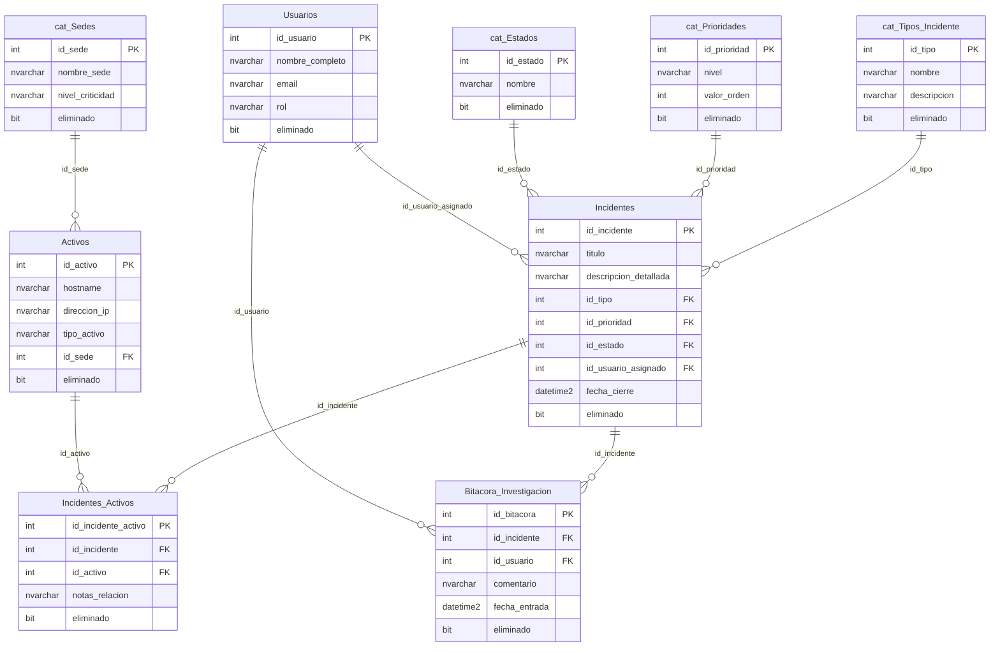

# Documentación

## Diagramas
### Modelos Entidad Relación

### Modelo Relacional

## Optimization 
Para este apartado la minima de datos para poder ver cambios y notar un diferencia junto a un beneficio a  simple vista requerimos entre **100.000** a **500.000** datos en la base de datos

---
### Vistas
#### `vw_Auditoria_Incidentes_Sede`
Cruza los incidentes con los activos afectados y la sede donde encuentra cada activo
**Uso y dependencia**
- `app/api/incientes.py`
	- Es consumida por el endpoint `GET /auditoria/sedes`
#### `vw_Incidentes_Criticos_Abiertos`

Es la vista del dashboard de emergencias.
Filtra solo los incidentes de prioridad **Alta** o **Critica** que aun no están cerrados
> [!info] Optimizacion
> Utiliza una subconsulta con `STRING_AGG()` para evitar filas duplicadas. Si un incidente crítico afecta a equipos en "Sede A" y "Sede B", en lugar de salir dos veces, devuelve una sola fila con la columna texto: _"Sede A, Sede B"_

**Uso y dependencias**
- `incidentes.py`
	- Se encarga de la tabla `Estado General` en la ruta raíz. 
- `06_Indices.sql`
		- Depende del indice `IX_Incidentes_PrioridadEstado_Soporte` para acelerar el filtro `WHERE` de nivel de prioridad

#### `vw_Top_Activos_Atacados`
Ranking de los equipos mas atacados.
Cuenta cuantos incidentes tiene cada activo.
Sirve para identificar que servidores o estaciones de trabajo están siendo comprometidas de forma repetitiva y necesitan atención especial

**Uso**
- `dashboard.py`: Alimenta el **Panel Morado de "Top 10 Activos Atacados"**.
- `06_Indices.sql` : Hay un indice que acelera el `COUNT()` de esta vista

---
### Procedimientos Almacenados
#### `sp_RegistrarIncidenteCompleto`
Registra un nuevo incidente en el sistema de manera **transaccional**.
**Uso y dependencias:**
- `app/api/incidentes.py` : Se usa al guardar incidentes en formulario de creación
#### `sp_CerrarIncidente`
Es el encargado de dar por concluida la investigación de una vulnerabilidad o ataque.
Hace un `UPDATE` a la tabla `Incidente` y añade un registro a la bitácora dejando constancia inmutable que el usuario cerro el caso
**Uso y Dependencias:**
- `app/api/incidentes.py` : Se activa desde la vista de detalle incidente al presionar el botón de "Cerrar Incidente"
#### `sp_AsignarAnalista`
Permite delegar o reasignar la investigación de un incidente a un miembro del equipo de ciberseguridad.
Antes de hacer un cambio verifica el `ID` si no existe lanza un error `RAISERROR` 
**Uso y dependencias:**
- `app/api/incidentes.py` : Se dispara en la vista de Detalles mediante un pequeño formulario despegable que lista los usuario registrados

---
### Triggers
#### `trg_AuditoriaEstadoIncidente`
Es un trigger de tipo `AFTER UPDATE` que vigila la tabla `Incidentes`.
Si detecta que el estado cambió (ej. de "Abierto" a "En Análisis"), inserta de un registro en la `Bitacora_Investigacion` documentando el salto exacto: _"Cambio Automático de Estado detectado: Abierto -> En Análisis."_
**Uso y Dependencias:**
- `app/api/incidentes.py` : se dispara automáticamente cuando un usuario usa el formulario de **Editar Incidente** (`procesar_editar_incidente`) y cambia el select de Estado, también se dispara cuando se presiona el botón de **Cerrar Incidente** (que invoca a `sp_CerrarIncidente`).
#### `trg_Auditoria_CambioPrioridad` 
Similar al anterior, pero vigila exclusivamente la tabla `Incidentes` en busca de un "Escalamiento"
**Uso y Dependencias:**
- `app/api/incidentes.py` : si el incidente subió de gravedad (ej. de "Baja" a "Crítica"), inserta una alerta en la bitácora con el texto: _"ALERTA DE ESCALAMIENTO: La prioridad del incidente severizó de Baja a Crítica"_.
#### `trg_PrevenirBorradoEvidencia`
Es el escudo de seguridad legal de tu sistema. Es un trigger `INSTEAD OF DELETE` sobre la tabla `Incidentes`.
**Uso y Dependencias:*
- `app/crud/incidentes.py`: Obliga a que la función de eliminar (`eliminar_incidente`) en el backend de Python utilice únicamente el **Borrado Lógico** (`UPDATE Incidentes SET eliminado = 1`) en lugar de borrar el dato físico.
#### Familia de Triggers `trg_UpdateAt_*`
Son 9 pequeños triggers `AFTER UPDATE` asignados a cada una de las tablas del sistema (Usuarios, Activos, Catálogos, etc.).
Cada vez que se actualiza cualquier dato en una fila, el trigger sobreescribe automáticamente el campo `fecha_actualizacion` insertando la marca de tiempo exacta del servidor (`GETDATE()`).
**Uso y Dependencias:**
- Todo el Backend Python

---
## Indices
#### `IX_Incidentes_FechaCreacion`
Es un índice Non-Clustered estructurado específicamente de forma descendente (`DESC`) sobre la columna `fecha_creacion` de la tabla `Incidentes`.

**Uso y Dependencias:**
-  **Todo el Backend (`incidentes.py` y `dashboard.py`)**: Es el que permite el Dashboard (`vw_Incidentes_Criticos_Abiertos`) pueda aplicar el `ORDER BY i.fecha_creacion DESC` instantáneamente.
#### `IX_Incidentes_PrioridadEstado_Soporte`
Es un **Índice Compuesto y de Cobertura (Covering Index)** diseñado quirúrgicamente para la vista de emergencias.
Tiene dos columnas llave (`id_prioridad`, `id_estado`). Permite a la base de datos filtrar en un abrir y cerrar de ojos todos los incidentes críticos y que no están cerrados.

**Uso y Dependencias:**

- `vw_Incidentes_Criticos_Abiertos`: Este índice es el motor principal detrás del widget amarillo ("Estado General" y tabla de críticos) del dashboard.
#### `IX_Incidentes_Activos_SoporteGroup`
Es un índice Non-Clustered sobre la tabla intermedia `Incidentes_Activos`, clave para las matemáticas de agrupación.
Esto permite que operaciones pesadas como `COUNT(ia.id_incidente)` agrupadas por activo no requieran acceder a la tabla real; el motor simplemente escanea el índice, cuenta los números adyacentes y genera los totales de volada.

**Uso y Dependencias:**
- `vw_Top_Activos_Atacados`: Es la columna vertebral del panel morado en el Frontend (la gráfica de **Top 10 Activos Atacados**). Al hacer el ranking de ataques, la base de datos puede sumar instantáneamente cuántas veces aparece un servidor en la tabla de relaciones utilizando este índice.
#### `IX_Activos_IDSede`
Índice Non-Clustered orientado a los filtrados geográficos y topológicos.
Permite agrupar o buscar los equipos (`Activos`) por su ubicación física (`id_sede`). Además, incluye la columna `hostname` directamente en el índice.

**Uso y Dependencias:**
- `app/api/incidentes.py` & Vistas:  Acelera masivamente la consulta de `vw_Auditoria_Incidentes_Sede` y cualquier endpoint futuro que el backend requiera para filtrar "Dame todos los activos de la Sede Norte".

---
## Seguridad, Roles y Permisos SQL 

### Logins y Usuarios de Base de Datos

El script separa estrictamente la autenticación del servidor (Logins) de la autorización en la base de datos (Usuarios).
- Se crearon dos Logins maestros (`login_developer` y `login_dba`) con contraseñas fuertes.
- A partir de estos, se crearon los usuarios locales `usr_developer` y `usr_dba` para interactuar únicamente con la base de datos `DB_GestionIncidentes`.

### `rol_dba` (Administrador / Control Total)

Es el rol asignado a los líderes técnicos o auditores jefes.
- Tiene membresía en el rol nativo `db_owner`, otorgándole control supremo.
- **Permisos Otorgados (`GRANT`):**
    - Tiene `SELECT, INSERT, UPDATE, DELETE` en absolutamente todas las tablas operacionales y de catálogos.
    - Puede leer (`SELECT`) todas las vistas estadísticas (`vw_Top_Activos_Atacados`, etc.).
    - Puede ejecutar (`EXECUTE`) cualquier Stored Procedure (crear, cerrar, asignar).

**Uso y Dependencias:**
Es la credencial que tu aplicación (o un DBA) usaría cuando un usuario con rol 'DBA' se loguea en la interfaz web, permitiéndole ver el Dashboard, crear/eliminar sedes, o modificar catálogos y usuarios en Python.
### `rol_developer` (Operador / Restringido)

Es el rol diseñado para el uso operativo diario de los analistas que registran incidentes, y está fuertemente limitado (Principio de Menor Privilegio).

- **Permisos Otorgados (`GRANT`):**
    - Puede consultar y crear (`SELECT, INSERT, UPDATE`) en tablas transaccionales como `Incidentes` y `Activos`.
    - Puede ejecutar el procedimiento `sp_RegistrarIncidenteCompleto`.
- **Prohibiciones Explícitas (`DENY`):** _El `DENY` en SQL Server sobreescribe cualquier otro permiso._
    - `DENY DELETE`: Bajo ninguna circunstancia puede borrar físicamente incidentes, activos o registros de la bitácora (protege contra destrucción de evidencia).
    - `DENY UPDATE` en `Bitacora_Investigacion`: Incluso si puede crear incidentes, **no puede alterar el historial** de lo que ya se registró.
    - `DENY` en Catálogos y Usuarios: Solo puede leerlos, no modificarlos.
    - `DENY SELECT` en las Vistas: No tiene permitido extraer inteligencia masiva de ataques o ver métricas corporativas del Dashboard.
    - `DENY EXECUTE` en `sp_CerrarIncidente` y `sp_AsignarAnalista`: No puede cerrar casos ni reasignar personal, eso es labor del DBA.
**Uso y Dependencias:**
 Este modelo garantiza que, si un usuario con rol 'Developer' en el frontend (Python) intenta hacer una petición HTTP tramposa para acceder al Dashboard o cerrar un incidente, **la base de datos de SQL Server rechazará la conexión con un error de permisos**, creando una muralla irrompible sin importar si la interfaz web falló.
