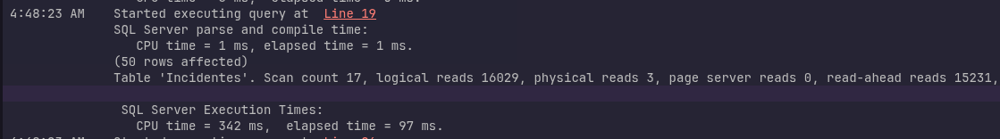
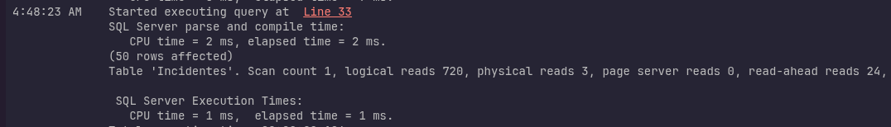
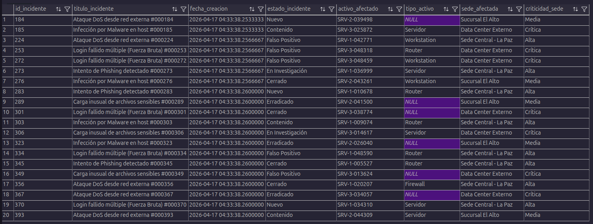
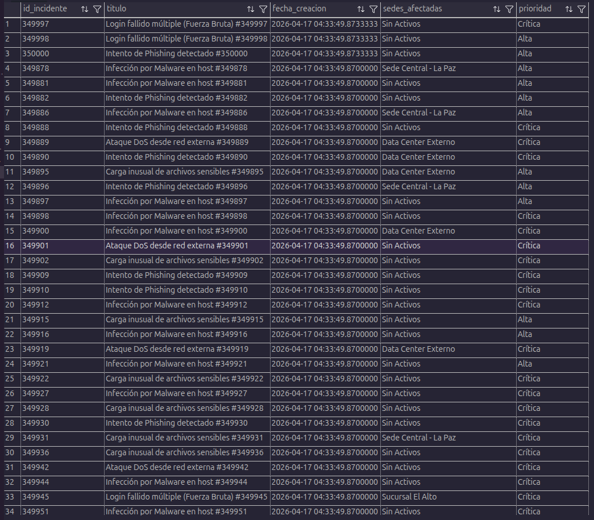
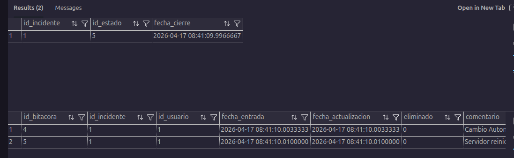

# Reporte de Pruebas y Optimización - SICC

## 1. Evidencia de Tiempos y Optimización de Consultas (Índices)

Se realizaron pruebas de rendimiento utilizando las herramientas de `STATISTICS IO, TIME` de SQL Server Management Studio para demostrar la reducción en tiempos de ejecución y lecturas lógicas al implementar índices no agrupados (*Non-Clustered Indexes*).

### Consulta Crítica Evaluada (Filtrado por Prioridad y Estado)
Esta consulta es la base de la vista de incidentes críticos abiertos, una de las más consultadas por el sistema.

**Script de Prueba Ejecutado:**
```sql
USE DB_GestionIncidentes;
GO
SET STATISTICS IO, TIME ON;
GO

-- LIMPIEZA DE CACHÉ (Para prueba justa - Cold Cache)
DBCC FREEPROCCACHE;
DBCC DROPCLEANBUFFERS;
GO

-- Prueba SIN Índice (Forzando escaneo completo)
SELECT TOP 50 id_incidente, titulo, fecha_creacion, id_prioridad, id_estado
FROM Incidentes WITH (INDEX(0))
WHERE id_prioridad IN (1, 2) AND id_estado <> 4 AND eliminado = 0
ORDER BY fecha_creacion DESC;

-- LIMPIEZA DE CACHÉ (Para prueba justa - Cold Cache)
DBCC FREEPROCCACHE;
DBCC DROPCLEANBUFFERS;
GO

-- Prueba CON Índice (Usando IX_Incidentes_PrioridadEstado_Soporte)
SELECT TOP 50 id_incidente, titulo, fecha_creacion, id_prioridad, id_estado
FROM Incidentes
WHERE id_prioridad IN (1, 2) AND id_estado <> 4 AND eliminado = 0
ORDER BY fecha_creacion DESC;

SET STATISTICS IO, TIME OFF;
GO
```

**Resultados de la Comparativa:**
| Métrica | Sin Índice (Table Scan) | Con Índice (Index Seek + Include) | Mejora |
| :--- | :--- | :--- | :--- |
| **Tiempo de CPU** | 342 ms | 1 ms | **> 99%** |
| **Tiempo Transcurrido (Total)** | 97 ms | 1 ms | **> 98%** |
| **Lecturas Lógicas** | 16,029 | 720 | **Reducción del 95% de I/O** |

**EVIDENCIA VISUAL:**

**Sin Indice**



**Con Indice**




---

## 2. Ejecución de Vistas Optimizadas

Las vistas se han estructurado utilizando los índices creados y evitando el uso de `SELECT *`, asegurando que el plan de ejecución sea eficiente.

### 2.1 Vista: vw_Auditoria_Incidentes_Sede
**Script Ejecutado:**
```sql
SELECT TOP 20 * FROM vw_Auditoria_Incidentes_Sede;
```
**EVIDENCIA VISUAL:**



### 2.2 Vista: vw_Incidentes_Criticos_Abiertos
**Script Ejecutado:**
```sql
SELECT * FROM vw_Incidentes_Criticos_Abiertos;
```
**EVIDENCIA VISUAL:**



---

## 3. Ejecución de Stored Procedures (Transacciones y Manejo de Errores)

Se demuestra el correcto funcionamiento de los Stored Procedures transaccionales (con `BEGIN TRAN`, `COMMIT`, `TRY...CATCH`).

### 3.1 Registro de un Incidente Completo (Alta de Datos)
**Script Ejecutado:**
```sql
DECLARE @NuevoID INT;
EXEC sp_RegistrarIncidenteCompleto 
    @titulo = 'Falla de conexión en el servidor principal',
    @descripcion_detallada = 'No hay ping al servidor desde la VLAN 20.',
    @id_tipo = 1,
    @id_prioridad = 1, -- Alta
    @id_estado = 1, -- Abierto
    @id_usuario_asignado = 1, -- Usamos el ID 1 (el administrador por defecto)
    @id_activo = 3; -- ID de activo opcional
```
**EVIDENCIA VISUAL:**


### 3.2 Cierre de Incidente (Actualización y Trigger/Bitácora)
**Script Ejecutado:**
```sql
-- Cierra el incidente ID 1 (Cambia al ID generado en el paso anterior)
EXEC sp_CerrarIncidente 
    @id_incidente = 1,
    @id_usuario_cierre = 1,
    @nota_cierre = 'Servidor reiniciado, conexión restablecida con éxito.';

-- Verificando que se cambió el estado y se registró en la bitácora
SELECT id_incidente, id_estado, fecha_cierre FROM Incidentes WHERE id_incidente = 1;
SELECT * FROM Bitacora_Investigacion WHERE id_incidente = 1;
```
**EVIDENCIA VISUAL:**


