# Evidencia — optimización (PostgreSQL + MySQL)

Carga previa: `apply_benchmark_seed.py`  
> **ANALYZE** / **ANALYZE TABLE** se ejecutan en los scripts pero no se capturan (en DataGrip no muestran grilla útil).

---

# PostgreSQL — Santa Cruz

Script: [`postgres/test/optimizacion_explain.sql`](../postgres/test/optimizacion_explain.sql)

## 1. Conteos

| Métrica | Resultado |
|---------|-----------|
| Total incidentes | **14 024** |
| Benchmark `[Bench]%` | **14 000** |
| Filtro ANTES (`id_estado = 1`) | **2 355** |
| Filtro DESPUÉS (`id_sede = 1` + `id_estado = 1`) | **1 688** |

### 1.1 Total de incidentes

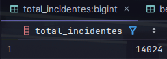

### 1.2 Incidentes benchmark

### 1.3 Filtro consulta ANTES

### 1.4 Filtro consulta DESPUÉS

El filtro con **sede** reduce filas candidatas (2 355 → 1 688) antes del `EXPLAIN`.

---

## 2. EXPLAIN — sin optimizar vs con optimización

| | Sin optimizar | Con optimización |
|---|---------------|------------------|
| Consulta | `SELECT *` solo `id_estado = 1` | Columnas + `id_sede = 1` + `ORDER BY` + `LIMIT 50` |
| Plan | Bitmap Index Scan (`idx_incidentes_estado`) | Index Scan Backward (`idx_incidentes_fecha`) + `Limit` |
| Tiempo ejecución | **~1,56 ms** | **~0,14 ms** |
| Filas devueltas | 2 355 | 50 |

### 2.1 Sin optimizar (consulta ANTES)

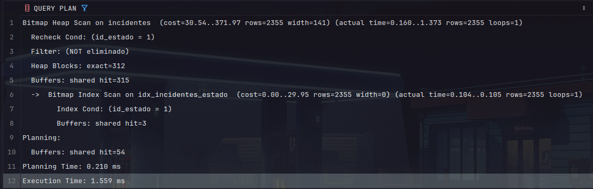

### 2.2 Con optimización (consulta DESPUÉS)

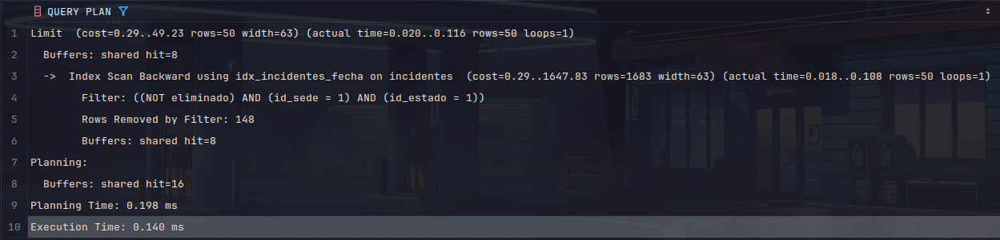

---

## 3. Vista agregada

`vw_resumen_incidentes_por_estado` — usa `idx_incidentes_sede`; tiempo ejecución **~6,94 ms**.

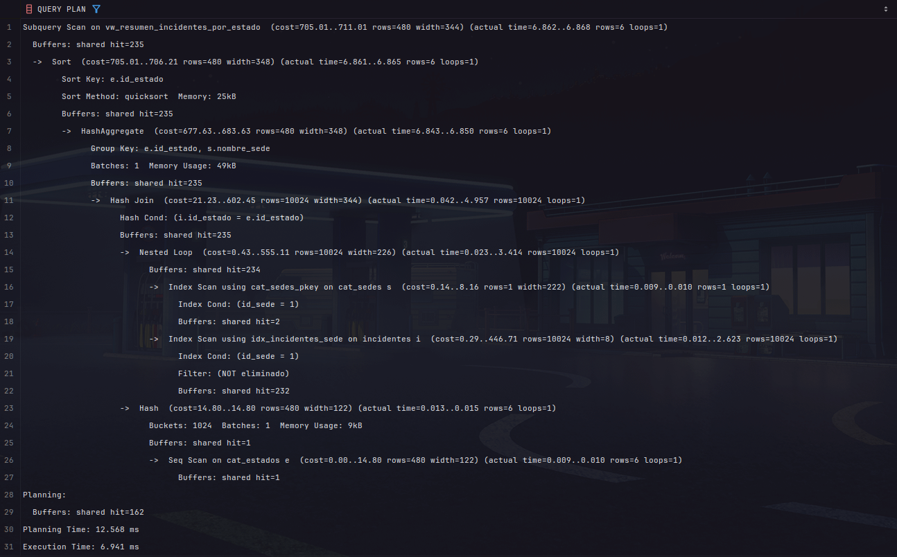

---

## 4. Índices en `Incidentes`

`idx_incidentes_sede`, `idx_incidentes_estado`, `idx_incidentes_fecha`, `idx_incidentes_prioridad`, `idx_incidentes_asignado`, PK `uuid`.

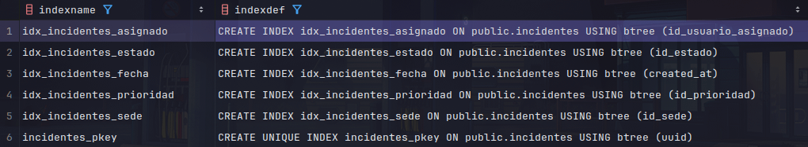

---

## 5. Estadísticas (`pg_stats`)

Columnas clave del optimizador tras `ANALYZE`: `id_sede`, `id_estado`, `created_at`.

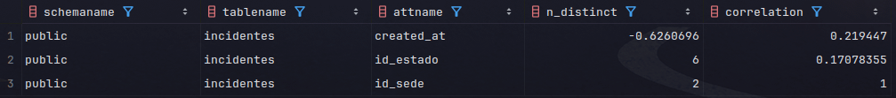

---

# MySQL — Cochabamba

Script: [`mysql/test/optimizacion_explain.sql`](../mysql/test/optimizacion_explain.sql)  
Consulta optimizada con **`id_sede = 2`**.

## 1. Conteos

| Métrica | Resultado |
|---------|-----------|
| Total incidentes | **14 005** |
| Benchmark `[Bench]%` | **14 000** |
| Filtro ANTES (`id_estado = 1`) | **2 336** |
| Filtro DESPUÉS (`id_sede = 2` + `id_estado = 1`) | **1 669** |

### 1.1 Total de incidentes

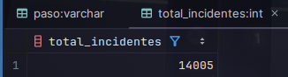

### 1.2 Incidentes benchmark

### 1.3 Filtro consulta ANTES

### 1.4 Filtro consulta DESPUÉS (sede Cochabamba)

El filtro con **sede** reduce filas candidatas (2 336 → 1 669).

---

## 2. EXPLAIN — sin filtro de sede vs con optimización

| | Sin filtro sede | Con optimización |
|---|-----------------|------------------|
| Consulta | `SELECT *` solo `id_estado = 1` | Columnas + `id_sede = 2` + `ORDER BY` + `LIMIT 50` |
| Plan | Index lookup (`idx_incidentes_estado`) + Filter | Index scan reverse (`idx_incidentes_fecha`) + Filter + `Limit 50` |
| Tiempo (actual) | **~8,67 ms** | **~2,06 ms** |
| Filas devueltas | 2 336 | 50 |

### 2.1 Sin filtro de sede (consulta ANTES)

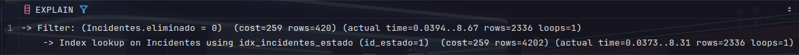

### 2.2 Con filtro sede + LIMIT (consulta DESPUÉS)

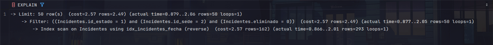

---

## 3. Vista agregada

`vw_resumen_incidentes_por_estado` — `idx_incidentes_sede` (`id_sede = 2`); tiempo **~72,3 ms**.

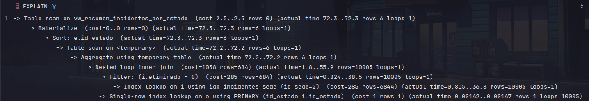

---

## 4. Índices en `Incidentes`

`idx_incidentes_sede`, `idx_incidentes_estado`, `idx_incidentes_fecha`, `idx_incidentes_prioridad`, `idx_incidentes_asignado`, PK `uuid`.

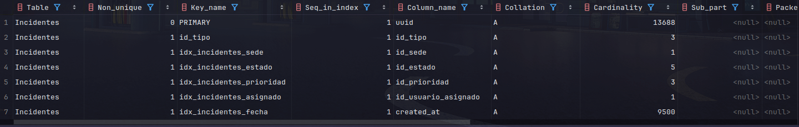
